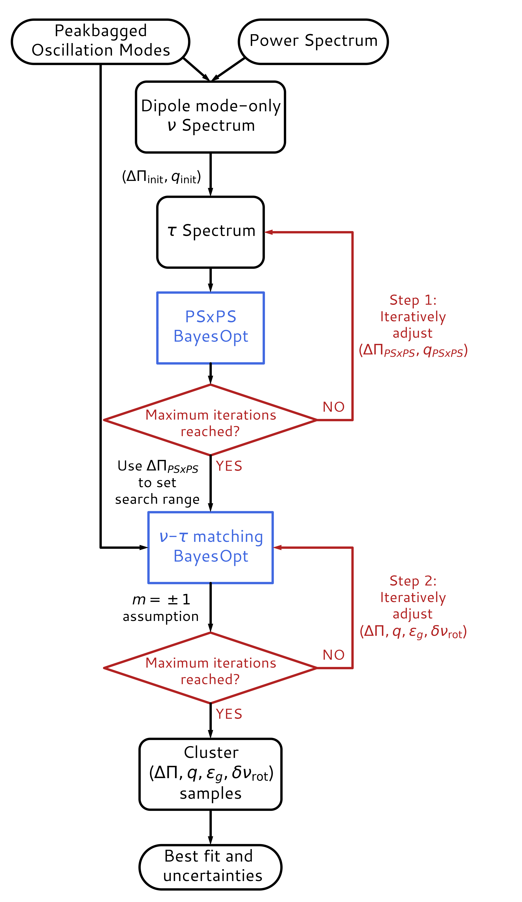

# BOChaMM
**B**ayesian **O**ptimisation for the **Cha**racterisation of **M**ixed **M**odes.

### This branch includes all data for the entire sample. Please use the other branch if you are interested in the code but do not want to download everything (i.e., peakbagged modes, samples from BayesOpt).

## Accessing the repository and code
Execute the following to your base directory of choice:

```bash
git clone https://github.com/jsk389/BOChaMM.git
```

<<<<<<< HEAD
## Main directories
1. `peakbag/` -- Contains the peakbagged modes for all red giants examined in our study.
2. `notebooks/` -- Contains two notebooks detailing our method of measuring mixed-mode parameters. Visit these to learn how to use our data products and code.
3. `results/images/` -- Contains plots of stretched echelle diagrams of our fits. 
4. `results/samples/` -- Contains samples from the Bayesian optimizer for the forward modelling step. See the notebooks on how to use these.
5. `results/tables/` -- Summary of results from the paper.


### Due to the large volume of the data products (peakbagged modes, BayesOpt samples, etc.), we have migrated the full dataset to Zenodo, with a few examples in the existing repo folders. Get the full data [here](https://zenodo.org/record/7888633).

## Visualization
=======
>>>>>>> cfd5bc4cece4adda5f92feae6d2d1f0eac5cdc3f

The following schematic demonstrates the optimization procedures involved in BoCHaMM. 




BOChaMM uses the [TuRBO](https://github.com/uber-research/TuRBO) algorithm for optimization, with a quick preview on how it applies to the PSxPS task shown in the following: 


<<<<<<< HEAD
## To-do-list

- [ ] High-level version of notebooks
- [ ] Notebook for producing plots in paper
- [ ] Proper import to `sloscillations` repo
- [ ] Package code and make docs
- [ ] Binder notebook

## Reference
=======
>>>>>>> cfd5bc4cece4adda5f92feae6d2d1f0eac5cdc3f

